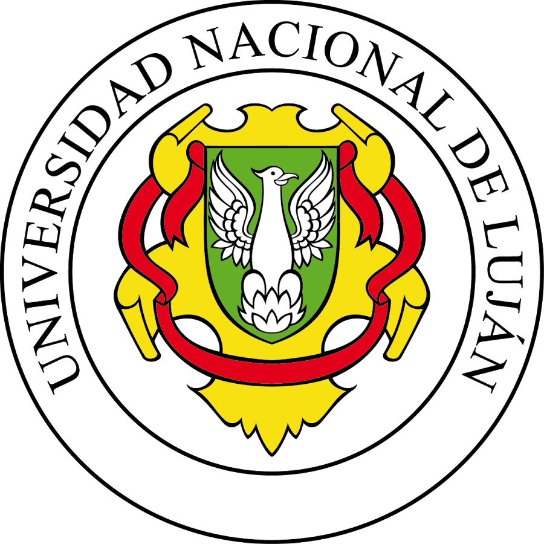

# Sistema Administracion Colegio Secundario

## Seminario de Integracion Profesional

## Indice
~~~
- [Equipo docente](#equipo-docente)
- [Integrantes del grupo](#integrantes-del-grupo)
- [Acerca del proyecto](#acerca-del-proyecto)
- [Desarollado con](#desarrollado-con)
- [Demo en vivo](#demo-en-vivo)
- [Instalación desde el código fuente](#instalacion-desde-el-codigo-fuente)
- [Documentación](#documentacion)
- [Licencia](#licencia)
~~~

## Equipo docente
~~~
 Bibiana D. Rossi  
 David M. Petrocelli  
 Viviana P. Chapetto  
~~~  
## Integrantes del Grupo
  ~~~
  Viola Facundo - 133176  
  Joaquin Bert - 133168  
  Joaquin Tossello - 154590  
  ~~~
  ## Instalacion(Windows)
  ~~~
  -Descargar e Instalar:  
    https://git-scm.com/download/win  
    https://getcomposer.org/download/  
    https://www.apachefriends.org/es/download.html  
    
   -Clonar el Repositorio:
        - git clone https://github.com/VFacundo/Administracion-Colegio
        - Instalar las dependencias via Composer: php composer install  
        - Modificar el Archivo .env con las credenciales de la Base de Datos  
        - Generar una Clave: php artisan key:generate
        - Ejecutar las migraciones y Seeders: php artisan migrate:fresh --seed
        - Correr el Servidor: php artisan serve  
  ~~~
    
  ## Documentacion  
  ~~~
  -Especificacion General de Requerimientos
   - [Documento PDF](documentacion/egr/egr.pdf)  
   - [Proyecto EA](documentacion/egr/admin_colegio.ea)  
 
 - PPS  
   - [Carta de Aceptacion](documentacion/pps/carta_aceptacion.jpg)  
   - [Carta de Cumplimiento](documentacion/pps/carta_cumplimiento.jpg)  
   
 - [Modelo de Negocios](documentacion/modelo_de_negocios.pdf)  
 ~~~
    
